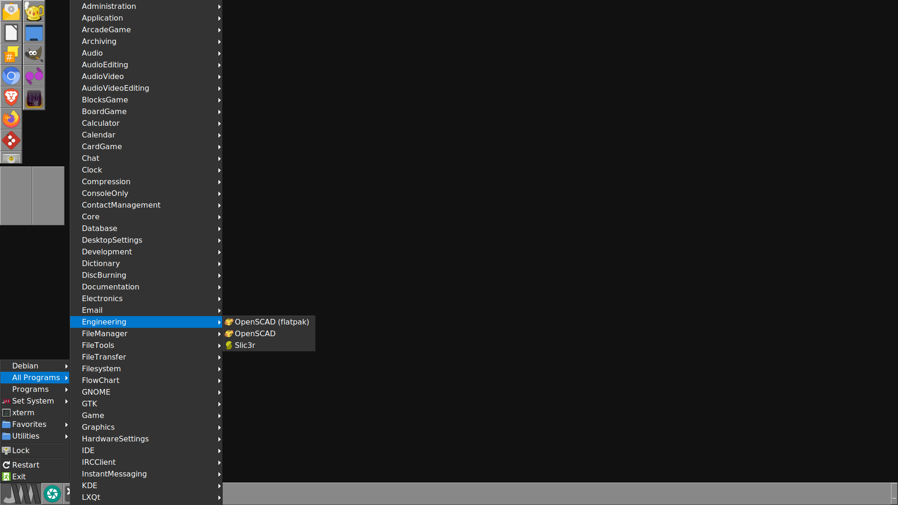

# pyjwm
Use this set of Python utilities to configure Joe's Window Manager (jwm).

## Requires
- Joe's Window Manager (jwm)

## Use
Run the regen-all.sh script to run with the most common options:
- The "Programs" menu ~/.local/share/applications-menu will contain all programs in ~/.local/share/applications
- The "All Programs" menu ~/.local/share/system-applications-menu will contain all programs there plus /usr/share/applications, /usr/local/share/applications and /var/lib/flatpak/app

Add the "Programs" and/or "All Programs" to your ~/.jwmrc as desired, perhaps like the last 2 lines in the example code below. Much more would come after them instead of ". . ."--If you need an example, see `/etc/jwm/system.jwmrc`.
```XML
<?xml version="1.0"?>
<JWM>
    <!-- The root menu. -->
    <RootMenu onroot="12">
        <Include>/etc/jwm/debian-menu</Include>
        <Include>/home/owner/.local/share/system-applications-menu</Include>
        <Include>/home/owner/.local/share/applications-menu</Include>
. . .
```

The regen-all.sh script calls the jwmgen.py script, which will automatically add " (flatpak)" to the end of the visible name of the program if the Exec line of the desktop file contains "flatpak". This will allow you to knowingly choose between 2 different programs if both a packaged or self-built version and a flatpak version is installed:



### Advanced
See the instructions in the `__doc__` string in [./pyjwm/jwmgen.py](pyjwm/jwmgen.py) to use jwmgen.py directly instead of calling regen-all.sh. More examples are in [regen-all.sh](regen-all.sh) itself.
